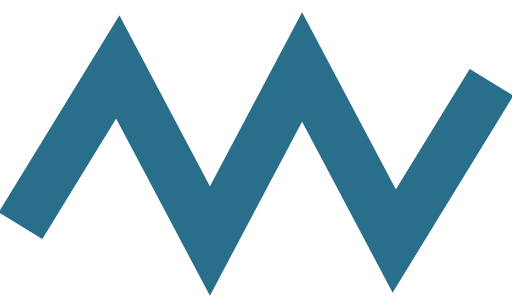

<p align="center"></p>

# ZigZag

**ZigZag** is a robust, machine-learning-free algorithm for **document image binarization** and **background removal**, designed for photos captured under difficult, non-uniform lighting. Built around integral images, it is fast, accurate, and simple — it ranked **first** in the [DocEng'24 binarization competition](https://doi.org/10.1145/3685650.3686793) and took the [**Douglas Engelbart Best Paper Award**](https://www.sigweb.org/awards).

**[▶ Try the live demo](https://bloechle.github.io/zigzag/)** — runs entirely in your browser, no upload.

📄 Read the paper: [*ZigZag: A Robust Adaptive Approach to Non-Uniformly Illuminated Document Image Binarization*](https://doi.org/10.1145/3685650.3685661) — ACM DocEng 2024.

## Repository layout

| File / folder | Content |
|---|---|
| [`ports/zigzag.py`](ports/zigzag.py) | Reference implementation — single file, CPU/GPU backends, full CLI |
| [`ports/ZigZag.java`](ports/ZigZag.java) | Java implementation — single file, multi-threaded, same CLI |
| [`js/zigzag.js`](js/zigzag.js) | Browser implementation — dependency-free ES module |
| [`js/zigzag-gpu.js`](js/zigzag-gpu.js) | Optional WebGPU accelerator — same pipeline as WGSL compute shaders |
| [`js/zigzag-worker.js`](js/zigzag-worker.js) | Runs the CPU port off the main thread for the web app |
| [`index.html`](index.html) | Web app & demo — single self-contained page built on `zigzag.js` |
| [`sw.js`](sw.js) | PWA service worker — must stay at the repository root (GitHub Pages scope) |
| [`tools/parity.py`](tools/parity.py) | Cross-port parity harness — proves the three ports agree bit for bit |
| [`examples/`](examples/) | Sample input images and their binarized outputs |

## Algorithm

ZigZag is a two-pass local mean filter. **Pass A** classifies likely background pixels: a pixel is background when its value reaches the weighted local mean (`weight`, in percent, over a `size`×`size` window). **Pass B** normalizes each pixel against the local mean of background-only pixels, which equalizes non-uniform illumination and makes the foreground histogram cleanly bimodal; a single global Otsu threshold then suffices. See the paper for the details.

Two parameters: `size` (window, default 30 px) and `weight` (mean percentage, default 90 — lower it to ~60 for degraded historical documents). A third, optional knob, `threshold-offset` (default 0), manually shifts the auto Otsu threshold up or down — automatic detection is preserved, the offset just nudges the cut; it is effective in all three modes.

Output modes: `binary` (thresholded, 2× upsampled by default for detail preservation), `gray` (normalized foreground; the background, at or above the Otsu threshold, is cleaned to pure white — the cutoff is thresholded at 2× and averaged back, i.e. antialiased for free), `color` (same antialiased cleanup, with the original colors re-applied to the foreground — luminance-guided, hue-preserving).

The three ports share the same float64 arithmetic and produce **bit-identical outputs** across languages, using separable rolling box sums in O(n). This is not a claim but a test: [`tools/parity.py`](tools/parity.py) runs all three over a matrix of images (colour, grayscale, RGBA, 16-bit, and degenerate 1-pixel-wide cases), modes and parameters, and compares every pixel.

```sh
python tools/parity.py     # 216 comparisons — any divergence is a bug
```

It runs in CI on every change to a port ([`.github/workflows/parity.yml`](.github/workflows/parity.yml)). It has already earned its keep: it caught the Java port decoding grayscale images through a linear-gray colour space, which shifted every sample (1 → 13, 128 → 186) against the Python and JS ports.

## Python (reference implementation)

One file; requires NumPy and OpenCV:

```sh
pip install numpy opencv-python
python zigzag.py photo.jpg                          # binary, size 30, weight 90
python zigzag.py -m color photo.jpg                 # color foreground
python zigzag.py -s 40 -w 60 old_letter.jpg         # historical documents
python zigzag.py -t *.jpg -o cleaned/               # batch into a directory, with timings
```

The result is written next to each input as `<name>_ZZ.png`. Options: `-o` output file — or directory when batching; `-T` threshold offset; `-t` separate load / process / save timings plus a batch summary; `--csv path` per-image metrics (parameters, thresholds, dimensions, timings) as CSV; `--no-upsample` to skip the binary 2×. `*`, `?` and `**` (recursive) patterns are expanded even where the shell does not (Windows) — e.g. `"scans/**/*.jpg"`, whose folder tree is mirrored under the output directory. Batching is noticeably faster per image: the first image pays the warm-up (NumPy/CuPy), the rest run at full speed.

**Optional NVIDIA GPU acceleration** — install CuPy and the GPU backend is auto-detected; the whole pipeline then runs in VRAM (exact integral-image sums, outputs identical to the CPU backend):

```sh
pip install cupy-cuda12x
python zigzag.py photo.jpg                          # gpu when available
python zigzag.py -b cpu photo.jpg                   # force a backend (auto|gpu|cpu)
```

## Java

One file, no dependencies, multi-threaded across all cores. Works on **Java 11+** and runs directly — no compilation step. The same file runs unmodified on every newer JDK, and noticeably faster: **JDK 25 processes ~25% faster than JDK 21** on identical bytecode (measured: 1130 → 845 ms/image on a single core; the JIT auto-vectorizes the pixel loops better) — use the latest JDK you have. It deliberately sticks to stable APIs — no incubator modules (e.g. the Vector API) — so the flag-free launch below always works:

```sh
java ZigZag.java photo.jpg                          # binary, size 30, weight 90
java ZigZag.java photo.jpg --mode=color             # color foreground
java ZigZag.java old_letter.jpg --size=40 --weight=60 --output=clean.png
java ZigZag.java *.jpg --output=cleaned/ --time     # batch into a directory, with timings
```

Options: `--mode=binary|gray|color` · `--size=N` · `--weight=N` · `--threshold-offset=N` · `--output=path|dir` · `--no-upsample` · `--time` (separate load / process / save timings plus a batch summary) · `--csv=path` (per-image metrics as CSV, same columns as the Python CLI). Accepts multiple inputs; `*`, `?` and `**` (recursive) patterns are expanded even where the shell does not (Windows) — e.g. `"scans/**/*.jpg"`, whose folder tree is mirrored under the output directory.

### API

```java
ZigZag.Options opts = new ZigZag.Options();   // mode, size, weight, upsample, thresholdOffset
opts.mode = "binary";
ZigZag.Result res = ZigZag.process(image, opts);
// res.image (BufferedImage), res.info (parameters used, auto Otsu, applied threshold)
```

## JavaScript & web demo

[`zigzag.js`](js/zigzag.js) is a dependency-free ES module operating on canvas `ImageData`:

```html
<script type="module">
  import { ZigZag } from './js/zigzag.js';

  const { data, width, height, info } = ZigZag.process(imageData, { mode: 'binary' });
  // info: parameters used, auto Otsu and applied threshold
</script>
```

Like the Python and Java ports, `thresholdOffset` (default 0) shifts the auto Otsu threshold; `info` reports both the auto and the applied values.

[`zigzag-gpu.js`](js/zigzag-gpu.js) is an optional WebGPU accelerator running the same pipeline as compute shaders — typically 10-50 ms where the CPU port takes around a second. The foreground is cached on the GPU, so switching the output mode, the 2× upsample or the threshold offset is near-instant. WebGPU uses float32 (no f64), so a handful of boundary pixels may differ from the CPU output by ±1 gray level — visually identical:

```js
import { ZigZagGPU } from './js/zigzag-gpu.js';

if (ZigZagGPU.isSupported()) {
    const gpu = new ZigZagGPU();
    await gpu.init();
    gpu.maxPixels;                                       // device ceiling, see below
    await gpu.uploadImage(imageData);                    // once per image
    const res = await gpu.process({ mode: 'binary' });   // same result shape
}
```

The 2× buffers cost 16 bytes per source pixel, and WebGPU's *default* storage-buffer binding limit is 128 MiB — only ~8.4 MP. `init()` therefore requests the adapter's real limits and exposes the resulting ceiling as `gpu.maxPixels`; downscale to it before uploading. Every submit runs inside a validation error scope, so a rejected dispatch throws instead of silently returning an unwritten buffer, which is what makes the CPU fallback reliable. The Otsu threshold is imported from `zigzag.js` rather than reimplemented, so the two backends cannot diverge on it.

[`index.html`](index.html) turns the repository into a mobile-first web app: shoot with the camera, pick, drop, or paste a document photo, switch between B&W / Gray / Color, rotate, tune **Window** (`size`, the analysis window in px), **Background** (`weight` — lower it to ~60 % to rescue faint ink on degraded documents) and **Ink** (`threshold-offset`), each with a plain-language explanation behind the **?** in the settings sheet, pinch-zoom and pan the full-width preview (double-tap to reset), swipe the comparison slider against the original (tap to toggle), and save, share or copy the result. Settings and mode are remembered between visits, and the keyboard drives everything on desktop: `1` `2` `3` modes, `R` rotate, `T` tune, `S` save, `C` share/copy, `N` new, `0` reset view, `space` toggle original, `←` `→` move the comparison slider.

Everything runs on-device: on the GPU when WebGPU is available (Chrome, Edge, Safari 26+), otherwise on the CPU port in a Web Worker so the interface stays responsive — the status line shows which backend ran. When a browser refuses to allocate the 2× output canvas, the app drops to 1× rather than showing a blank result. The page is an installable PWA: add it to your home screen and it works fully offline (`manifest.json` + `sw.js`, stale-while-revalidate). It is published with GitHub Pages at **[bloechle.github.io/zigzag](https://bloechle.github.io/zigzag/)**. To run it locally, serve the folder (ES modules don't load from `file://`):

```sh
python -m http.server   # then open http://localhost:8000
```

## Examples

[`examples/`](examples/) contains sample document photos taken under poor lighting and their binarized outputs, generated with the implementations above:

| Input | Output |
|---|---|
| `02_04.jpg` | `02_04_ZZ.png` |
| `10_18.jpg` | `10_18_ZZ.png` |

## Citation

If you use ZigZag in your research, please cite:

```bibtex
@inproceedings{10.1145/3685650.3685661,
  author    = {Bloechle, Jean-Luc and Hennebert, Jean and Gisler, Christophe},
  title     = {ZigZag: A Robust Adaptive Approach to Non-Uniformly Illuminated Document Image Binarization},
  booktitle = {Proceedings of the ACM Symposium on Document Engineering 2024},
  series    = {DocEng '24},
  year      = {2024},
  publisher = {Association for Computing Machinery},
  address   = {New York, NY, USA},
  doi       = {10.1145/3685650.3685661},
  url       = {https://doi.org/10.1145/3685650.3685661},
  isbn      = {9798400711695},
  articleno = {3},
  numpages  = {10},
  keywords  = {OCR, binarization, image processing, image thresholding},
  location  = {San Jose, CA, USA}
}
```

## License

ZigZag is released under the **GNU AGPL v3** (see [LICENSE](LICENSE)) — a copyleft license: any derivative work must remain open source under a compatible license.
