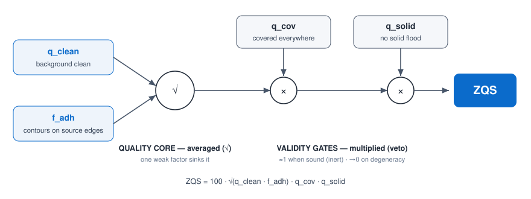
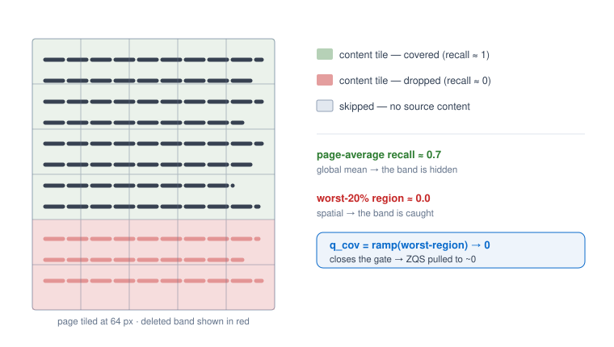

# ZQS — the method, and why it works

*Methodology note (English, for the paper). Companion to `ZQS_AUDIT.md` (the
technical audit) and the code in `eval.py:quality_metrics`. The aim is the
underlying intuition, not just the formulas.*

---

## 1. The problem

We want to **score the quality of a binarization** (the photo → black/white
conversion of a document) **with no ground truth and no OCR**. This is the
*no-reference* setting: all we have is the grayscale source photo and the
candidate binary image. Two uses follow: blind parameter selection, and **blind
algorithm ranking** (reproducing a competition's leaderboard without its GT).

The difficulty: with no reference, what even defines "correct"?

---

## 2. The central idea: the source IS the implicit ground truth

This is the pivot of the whole method.

> A photo of a document already contains, implicitly, the information about
> where the ink is — in its **gradients** (text edges create light→dark
> transitions) and in its **photometry** (the capture blur, the PSF ramp, marks
> the sub-pixel edge). A **correct** binarization is the one whose contours
> **coincide with these cues from the source**.

In other words, we replace "adhere to a GT" with "**adhere to the source**". We
do not know a priori where the text is, but we know that wherever there is text
the photo has a strong gradient — and conversely, a good black stroke must land
exactly on those strong gradients. Everything in ZQS follows from this.

The appeal: it is free and universal. No model, no training, no GT — only the
geometry of the very image we are trying to binarize.

---

## 3. The validated core: `√(q_clean · f_adh)`

Two complementary questions about the ink the binarization actually **placed**.

### q_clean — "is the ink clean?"

Binarization noise (salt-and-pepper, a speckled background) shows up as a swarm
of **tiny connected components** (≤ 8 pixels). We take their density per
megapixel and turn it into a score:

```
q_clean = 1 / (1 + speckles_per_mpx / 200)
```

No speckle → `q_clean ≈ 1`; a lot → `q_clean → 0`. It is the clean detector of
background noise, and it reacts to nothing else (selectivity confirmed in the E4
sensitivity matrix).

### f_adh — "is the ink in the right place?"

The heart of source adherence, built as an **F-score without a GT**:

- **precision** (`q_edge`) — do the binary's contours fall on strong source
  gradients? We measure the mean source gradient *under the ink boundary*,
  normalized by the image's mean gradient. A good stroke follows a real edge →
  high ratio. Noise placed anywhere → ratio ≈ 1 → precision ≈ 0.
- **recall** (`q_recall`) — are the strong source gradients covered by a binary
  contour? If not, text was missed.
- **f_adh** = the harmonic mean of the two (the F-measure structure).

This is exactly the precision/recall logic of a supervised evaluation, except the
"positive" is not a GT pixel — it is a **strong gradient of the photo**.

### Why the `√` (and not a mean of more terms)

`ZQS_core = 100 · √(q_clean · f_adh)`. The square root of a product of **two**
factors is harsh: if either collapses, the score plunges (√(1·0.1) = 0.32). That
is deliberate — a binarization is unusable as soon as **one** aspect breaks.
Adding terms dilutes: the fourth root of a weak factor recovers too much
(0.1^¼ = 0.56). So the core stays two-factor, validated against OCR (Spearman
≈ 0.84 on photos) and against PSNR (DIBCO method-ranking ρ ≈ 0.8–0.9).

---

## 4. Why the core alone is not enough: two outputs that "cheat"

The core measures *the quality of the ink that is present*. Two degenerate
outputs defeat it because they **adhere locally** while being globally wrong:

1. **The solid black flood** (a shadow binarized as a solid block). It has no
   tiny components → `q_clean ≈ 1`. And the block's boundary runs along the
   shadow edge, a real strong gradient → decent precision. The core scored it
   ~86.
2. **Dropped text**, especially **local** dropout (a deleted band). The
   *surviving* strokes are sharp → high precision; and recall, **averaged over
   the whole page**, is pulled up by the intact majority. The core never saw the
   missing band.

The common thread: these are failures of a **different nature** than "dirty ink"
or "mis-placed ink". They need **orthogonal** checks.

---

## 5. The two validity gates



*Figure 1 — the composite. Two source-adherence measures (`q_clean`, `f_adh`)
are **averaged** by the √ into a quality core; two validity gates (`q_cov`,
`q_solid`) then **multiply** it. A gate is ≈1 for a sound result (it disappears)
and →0 for a degenerate one (it vetoes).*

### q_solid — "a real stroke, or a flood?"

A handwriting/print stroke is **thin**: every ink point is close to an edge.
Mathematically, its **distance transform** (distance to the nearest white pixel)
stays small. A solid flood has a **deep interior**: pixels far from any edge. So
we take the fraction of ink whose distance exceeds a threshold `tau`:

```
tau     = bounded around 1.5 × (stroke width estimated on the SOURCE)
q_solid = 1 when that fraction is small (< 8%), → 0 when a solid blob dominates
```

The key subtlety: `tau` is keyed to the stroke width **of the source**, not of
the binary. A flood therefore **cannot inflate its own threshold** to declare
itself thin. The gate is inert (≈1) for genuine thin text and drops to 0 for a
flood.

### q_cov — "is the content covered EVERYWHERE?"

A global recall cannot tell "good method, recall 0.6 because of non-text edges"
from "40% of the text deleted, recall 0.6". Only a **spatial** view can. We tile
the page (64 px), keep only tiles that hold real source content (≥ 25 strong
gradients), measure each tile's coverage, then take the **mean of the worst 20%
of tiles**:

```
cov_worst = mean of the worst regions          (not the global mean!)
q_cov     = ramp [0.05, 0.40] → [0, 1]
```

A deleted band → tiles at coverage ≈ 0 → `cov_worst ≈ 0` → gate closed. A complete
page → every tile covered → gate open (≈1). The trick: **the worst region cannot
be diluted by the average** — precisely what was missing.



*Figure 2 — why coverage must be spatial. The source has text across the whole
page; the binary dropped the lower band (red). The page-average recall (~0.7)
still looks fine, so a global measure passes it. The worst-region coverage (~0.0)
catches the band and closes `q_cov`.*

---

## 6. The assembly: quality × validity

```
ZQS = 100 · √(q_clean · f_adh) · q_cov · q_solid
       └──── validated core ──┘   └─ gates ─┘
```

The aggregation principle is the most important design idea:

> **Quality factors are averaged; validity gates are multiplied.**

- *Averaging* (the `√`) answers "how good is it?" — a trade-off between
  comparable axes (cleanliness, adherence).
- *Multiplying by a gate* answers "is it even valid?" — a veto. A gate is ≈1 when
  all is well (it **disappears**, leaving the calibrated core intact) and 0 when
  the object is disqualified (the score vanishes, whatever the rest says).

This is why the gates are **not** folded into a four-term geometric mean: a mean
*dilutes* the veto (a flood at `q_solid = 0` would recover through the root),
whereas a product *preserves* it. Quality and validity are two different
questions, and we aggregate them differently.

---

## 7. Why it works, in one sentence

Because **the source photo is a free ground truth**: its gradients say where the
ink is, its photometry says where the edges are. ZQS measures the binary's
adherence to that source along four angles — *cleanliness*, *contour precision*,
*spatial coverage of content*, *absence of flood* — each mapping to one precise
**failure mode**. The first two (averaged) judge the quality of the ink that was
placed; the last two (as vetoes) close the doors the first two left open to
degeneracies. The result reproduces, blindly, the known hierarchy of algorithms.

---

## 8. Bonus: a score that diagnoses itself

ZQS is not just a scalar. The retained sub-measures form a **profile** that says
*why* a result is bad: noise → `q_clean`; broken strokes → `f_adh`; bleed →
precision; dropped text → `q_cov`; flood → `q_solid`. The kept diagnostics:

- `q_stroke` — stroke-width regularity (coefficient of variation of the
  distance-transform ridge).
- `q_swm` — agreement between the binary stroke width and the width estimated on
  the source.
- `edge_strong` — fraction of contour pixels on the top-decile source gradient (a
  strict adherence variant).
- `cc_per_mpx` — component-density / fragmentation.
- `cpo` — the **signed** sub-pixel offset of the contours from the source's
  photometric inflection. Its magnitude is a quality cue; its **sign** says which
  way to move the threshold (too much / too little ink). A one-shot directional
  calibrator, unique to photographs.

This is a clean argument for the paper: a blind evaluator that is also
*interpretable*.

---

## 9. Honesty: what still needs calibration

The gate ramps are set so that a **clean synthetic** result sits at 1; they have
not yet been re-fit on real photographs (WEZUT/DIB). All constants are centralized
in the `ZQS` dict at the top of the metric section. Two assumed limitations:
`q_cov` counts *any* strong source gradient as content (a false-positive risk on
pages with **figures** / non-text edges), and it is deliberately strict (a fully
deleted region → ZQS ≈ 0; this can be swapped for a graded penalty if preferred).
The recalibration protocol and these caveats are detailed in `ZQS_AUDIT.md`.

---

### Files

- `eval.py` — the metric (`quality_metrics`) and the `ZQS` constants block.
- `ZQS_AUDIT.md` — the audit: failure modes, root causes, validation table, TODO.
- `fig_zqs_pipeline.svg`, `fig_zqs_coverage.svg` — Figures 1 and 2 above.
